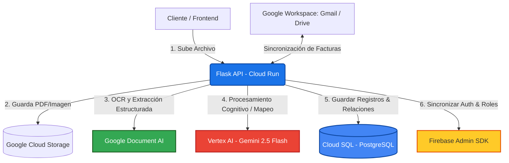

# 🛡️ Smart Invoice Backend — Abside

[](https://www.python.org/)
[](https://flask.palletsprojects.com/)
[](https://cloud.google.com/)
[](https://www.postgresql.org/)
[](https://deepmind.google/technologies/gemini/)

**Smart Invoice Backend** es el motor principal de la plataforma inteligente de procesamiento de facturas de **Abside**. Diseñado bajo una arquitectura modular y escalable con **Flask**, este backend aprovecha el poder de la Inteligencia Artificial de Google Cloud (**Document AI** para extracción de texto estructurado y **Gemini 2.5 Flash** para inferencia cognitiva avanzada) para procesar, validar, reconciliar e insertar facturas de forma automatizada y sin fisuras.

---

## 🏗️ Arquitectura de Flujo de Datos

El siguiente diagrama ilustra cómo interactúa el backend con los distintos servicios de Google Cloud y sistemas externos para procesar una factura:



---

## ⚡ Stack Tecnológico

- **Framework:** Flask 3.0.3 con soporte CORS completo para entornos multi-origen.
- **Base de Datos:** Cloud SQL (PostgreSQL) gestionado mediante **SQLAlchemy** y el conector oficial de alto rendimiento **pg8000**.
- **Procesamiento de Documentos:**
  - **Google Cloud Document AI:** Extracción especializada de metadatos de facturas (OCR inteligente, identificación de tablas, impuestos y proveedores).
  - **Vertex AI (Gemini 2.5 Flash):** Análisis cognitivo avanzado, mapeo de códigos de impuesto SAP, categorización de productos y asistente virtual en tiempo real (Chatbot).
- **Almacenamiento:** Google Cloud Storage (GCS) para repositorios de archivos crudos y procesados.
- **Autenticación y Seguridad:** Firebase Admin SDK para sincronización y validación de usuarios en tiempo real.
- **Integraciones:** API de Google Workspace (Gmail & Google Drive) para automatización del flujo de entrada de documentos.

---

## 🛣️ Catálogo de Endpoints (API Directory)

La API se organiza mediante Flask Blueprints bajo rutas modulares limpias y bien definidas:

### 👤 Usuarios y Roles (`/cloudsql/usuario`)
| Método | Ruta | Descripción |
| :--- | :--- | :--- |
| **GET** | `/cloudsql/usuario` | Obtiene la lista de todos los usuarios activos del sistema. |
| **POST** | `/cloudsql/usuario` | Registra de forma transaccional un usuario en la base de datos y en Firebase Auth. |
| **GET** | `/cloudsql/usuario/buscar` | Busca un usuario específico mediante su dirección de correo electrónico. |
| **GET** | `/cloudsql/usuario/<id_usuario>` | Obtiene los detalles de un usuario por su ID único. |
| **PATCH** | `/cloudsql/usuario/<id_usuario>` | Realiza actualizaciones parciales en la información de un usuario. |
| **DELETE** | `/cloudsql/usuario/<id_usuario>` | Elimina un usuario del sistema (con control de integridad). |

### 🏢 Proveedores y Sociedades (`/cloudsql`)
| Método | Ruta | Descripción |
| :--- | :--- | :--- |
| **GET** / **POST** | `/cloudsql/proveedores` | Obtiene o crea un registro de proveedor en el sistema. |
| **GET** / **PUT** / **DELETE** | `/cloudsql/proveedores/<id_proveedor>` | Consulta, actualiza o elimina un proveedor específico. |
| **GET** / **POST**| `/cloudsql/sociedades` | Obtiene o crea sociedades mercantiles/entidades SAP. |
| **GET** / **PUT** / **DELETE** | `/cloudsql/sociedades/<id_sociedad>` | Consulta, actualiza o elimina una sociedad mercantil. |

### 💸 Impuestos y Facturas (`/cloudsql`)
| Método | Ruta | Descripción |
| :--- | :--- | :--- |
| **GET** / **POST** | `/cloudsql/impuestos` | Obtiene o crea códigos de impuesto compatibles con SAP. |
| **GET** / **PUT** / **DELETE** | `/cloudsql/impuestos/<id_impuesto>` | Consulta, actualiza o elimina códigos de impuesto. |
| **GET** / **POST** | `/cloudsql/facturas` | Consulta facturas con filtros dinámicos o crea una factura (y sus líneas de detalle) de forma transaccional. |
| **GET** / **PUT** / **DELETE** | `/cloudsql/facturas/<id_factura>` | Consulta, actualiza (con edición de líneas) o elimina una factura y sus dependencias de forma segura. |

### 🧠 Inteligencia Artificial e Inferencia (`/process` / `/extract-invoice`)
| Método | Ruta | Descripción |
| :--- | :--- | :--- |
| **POST** | `/documentai/process` | Procesa un archivo PDF/Imagen utilizando Google Document AI para extraer sus campos base. |
| **POST** | `/gemini/extract-invoice` | Utiliza Gemini 2.5 Flash para realizar análisis lingüístico y estructurar elementos complejos del documento. |

### 📁 Almacenamiento en la Nube (`/storage`)
| Método | Ruta | Descripción |
| :--- | :--- | :--- |
| **POST** | `/storage/upload` | Sube un documento de factura al bucket configurado en Google Cloud Storage. |
| **GET** / **POST** / **DELETE** | `/storage/files` | Lista, guarda metadatos o elimina archivos físicos del bucket. |

### 📂 Integración Google Workspace (`/workspace`)
| Método | Ruta | Descripción |
| :--- | :--- | :--- |
| **GET** / **POST** / **PATCH** / **DELETE** | `/workspace/gmail` | Interactúa y gestiona correos electrónicos de Gmail vinculados a la recepción de facturas. |
| **GET** | `/workspace/drive/listar` | Lista los archivos disponibles en la carpeta de Google Drive configurada. |
| **GET** | `/workspace/drive/descargar/<file_id>` | Descarga un archivo de Google Drive directamente a través del backend. |
| **POST** / **DELETE** | `/workspace/drive/carpeta` | Crea o elimina carpetas organizativas dentro de Google Drive. |
| **POST** | `/workspace/drive/subir` | Sube facturas procesadas a Google Drive para respaldo definitivo. |

---

## 🛠️ Guía de Configuración Local

### Prerrequisitos
- **Python 3.11** o superior instalado en el sistema.
- Acceso a un proyecto de **Google Cloud Platform (GCP)** con las APIs correspondientes activas (Document AI, Vertex AI, GCS, Cloud SQL).
- Cuenta de servicio con rol de editor o permisos específicos descargada en formato `.json`.

### 1. Clonar el repositorio y configurar el entorno
Accede al directorio del backend y crea un entorno virtual de Python:

```bash
# Crear entorno virtual
python -m venv .venv

# Activar entorno virtual
# En Windows (Powershell):
.venv\Scripts\Activate.ps1
# En Linux/macOS:
source .venv/bin/activate

# Instalar dependencias requeridas
pip install -r requirements.txt
```

> [!NOTE]
> Para evitar errores de procesamiento PDF (`TypeError: PDF.__init__()`), asegúrate de que las versiones de `weasyprint` y `pydyf` se instalen exactamente como se indica en `requirements.txt` (`weasyprint==59.0` y `pydyf==0.8.0`).

### 2. Configurar Variables de Entorno (`.env`)
Crea un archivo `.env` en la raíz de `smartInvoice_backend` utilizando el siguiente formato:

```env
# === Configuración Base de Datos (Cloud SQL / Postgres) ===
userbd="postgres"
passwordbd="TU_PASSWORD_DE_DB"
bd="postgres"
# Cadena de conexión de la instancia de Google Cloud SQL:
direccion="tu-proyecto:us-central1:tu-instancia-sql"

# === Credenciales de GCP y Firebase ===
proyecto_id="tu-proyecto-gcp"
ubicacion="us-central1"
target_service_account="cuenta-servicio@tu-proyecto-gcp.iam.gserviceaccount.com"

# Ruta absoluta al archivo JSON de credenciales de Google Application
google_application_credentials="C:\ruta\a\tus\credenciales\gcp.json"

# Ruta absoluta al archivo JSON de credenciales de Firebase Admin SDK
FIREBASE_CREDENTIALS_PATH="C:\ruta\a\tus\credenciales\firebase.json"

# === Configuración de Buckets de GCS ===
invoices_bucket_name="smart-invoice"
unscanned_bucket_name="ordenes_compra"
```

### 3. Conexión de Base de Datos Local (Cloud SQL Proxy)
Para interactuar con la base de datos Cloud SQL PostgreSQL de manera local y segura sin exponer IPs públicas, utiliza el binario de **Cloud SQL Auth Proxy**:

```bash
# Ejecutar proxy en puerto local por defecto (5432)
.\cloud-sql-proxy.exe --address 127.0.0.1 --port 5432 tu-proyecto:us-central1:tu-instancia-sql
```

El backend detecta automáticamente si el proxy está corriendo en `127.0.0.1:5432` y lo prioriza antes de intentar levantar un nuevo socket de conexión.

### 4. Ejecutar el Servidor Flask
Con el entorno virtual activo y el proxy de base de datos encendido, inicia el servidor de desarrollo:

```bash
python main.py
```

Por defecto, la API se levantará en el puerto `8080` (`http://localhost:8080`). Al ingresar a la raíz (`/`), deberías recibir una respuesta confirmando el estado de la API:
```json
{
  "msg": "API modularizada en Cloud Run"
}
```

---

## 🐳 Despliegue en Producción (Cloud Run)

Este backend está optimizado para ejecutarse en entornos serverless mediante **Google Cloud Run** empaquetado en un contenedor Docker.

El `Dockerfile` incluido realiza una compilación multi-etapa eficiente instalando las librerías del sistema necesarias para compilar dependencias como `weasyprint` y `pypi-magic`.

Para desplegar una nueva versión en Cloud Run:
```bash
# Construir la imagen del contenedor en Google Artifact Registry
gcloud builds submit --tag gcr.io/tu-proyecto-id/smart-invoice-backend:latest

# Desplegar en Cloud Run
gcloud run deploy smart-invoice-backend \
  --image gcr.io/tu-proyecto-id/smart-invoice-backend:latest \
  --platform managed \
  --region us-central1 \
  --allow-unauthenticated
```
